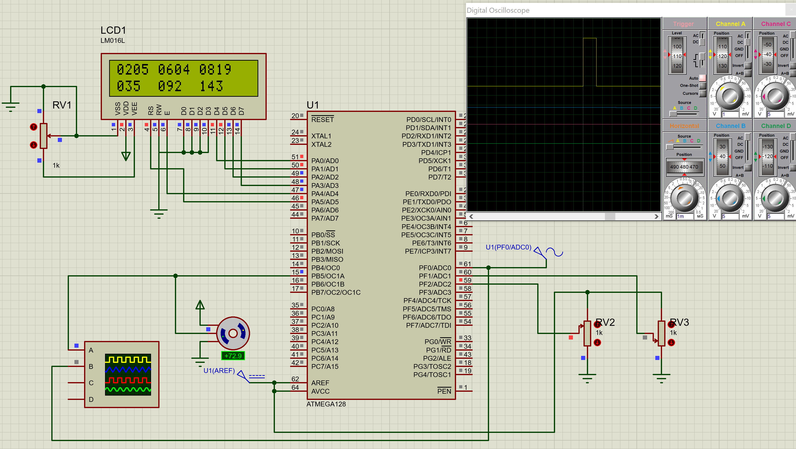

Для задания:

Собрать схему и составить программу интерпретатор,
преобразующего аналоговый сигнал в ШИМ сигнал
определенной скважности для управления положением
стандартного сервопривода. В программе предусмотреть
фильтрацию сигнала и ограничение на угол поворота
сервопривода, параметры аналогового и ШИМ сигнала вывести
на дисплее.

